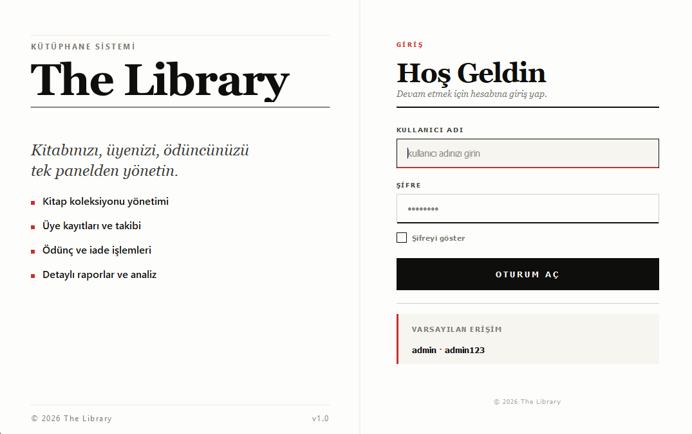
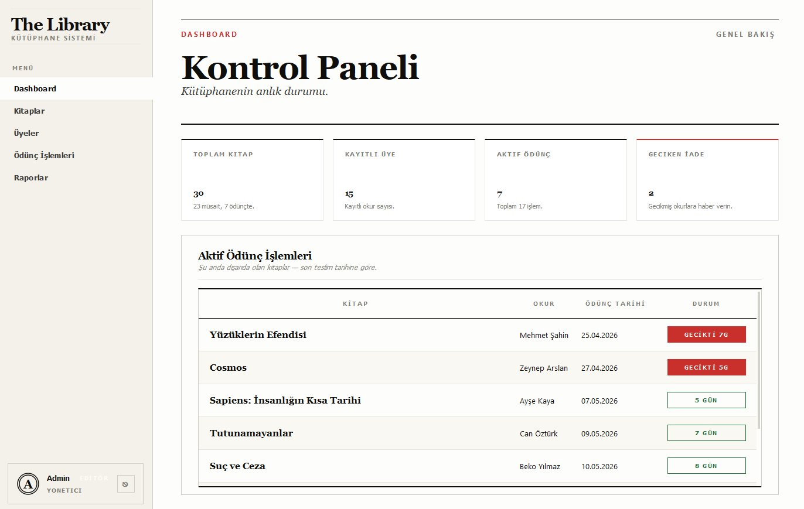
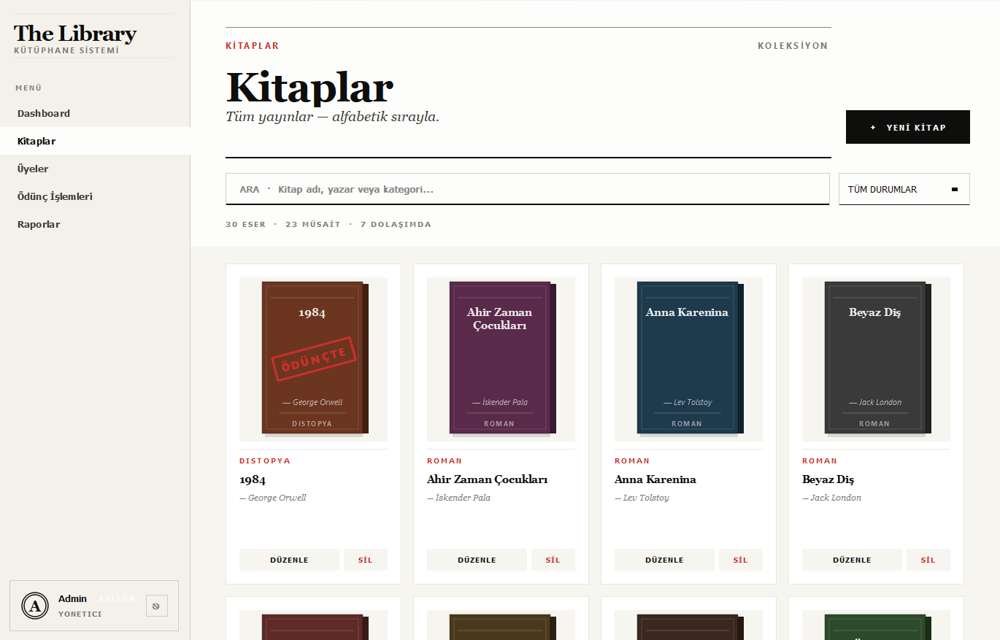
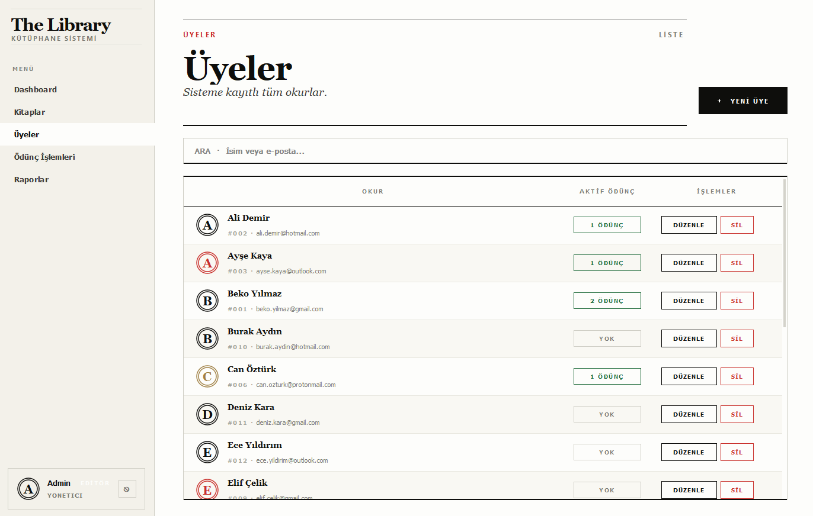
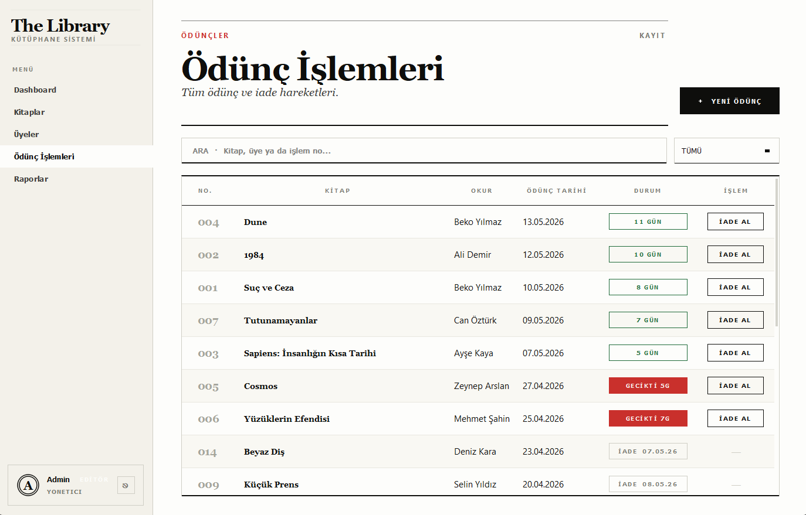
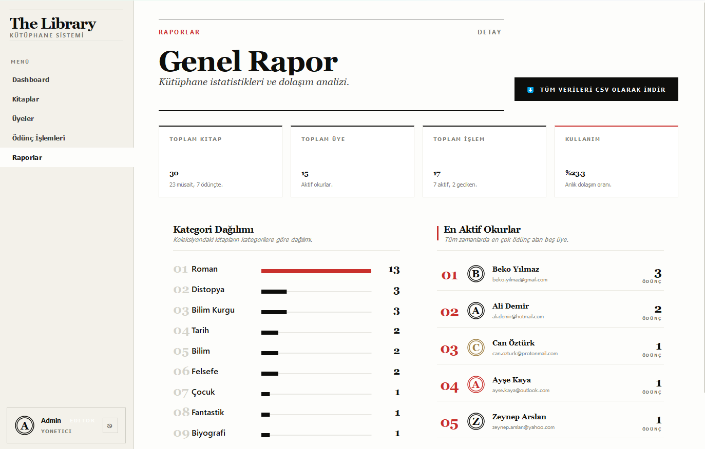

# LibraryHub - Dijital Kutuphane Yonetim Sistemi

Kitaplarin kataloglanmasi, uyelik yonetimi, odunc verme/iade islemleri ve gecikmis iadeler takibi icin gelistirilmis masaustu uygulamasidir. PyQt5 ile editorial/gazete tarzinda bir arayuz sunar.

## Teknolojiler

- **Python 3** - Programlama dili
- **PyQt5 (>=5.15.0)** - Masaustu GUI framework
- **JSON** - Veri kaliciligi
- **PBKDF2-HMAC-SHA256** - Sifre guvenligi

## Proje Yapisi

    PROJE 3 - Dijital Kutuphane Sistemi/
    ├── main.py                          # Ana giris noktasi
    ├── requirements.txt                 # Bagimliliklar
    ├── backend/
    │   ├── veri_yoneticisi.py          # CRUD islemleri ve istatistikler
    │   ├── kitap.py                    # Kitap modeli
    │   ├── uye.py                      # Uye modeli
    │   ├── odunc.py                    # Odunc islemi modeli
    │   ├── auth.py                     # Kimlik dogrulama
    │   └── seed.py                     # Ornek veri yukleme
    ├── frontend/
    │   ├── ana_pencere.py              # Ana pencere
    │   ├── login.py                    # Giris ekrani
    │   ├── tema.py                     # Editorial tema
    │   ├── views/
    │   │   ├── dashboard.py            # Kontrol paneli
    │   │   ├── kitaplar.py             # Kitap yonetimi
    │   │   ├── uyeler.py               # Uye yonetimi
    │   │   ├── oduncler.py             # Odunc islemleri
    │   │   └── raporlar.py             # Istatistikler ve raporlar
    │   └── widgets/
    │       ├── bilesenler.py           # UI bilesenleri
    │       └── diyaloglar.py           # Modal diyaloglar
    ├── images/                          # Ekran goruntuleri
    └── data/
        ├── kitaplar.json
        ├── uyeler.json
        ├── oduncler.json
        └── kullanicilar.json

## Ana Siniflar

### Kitap (`backend/kitap.py`)

- **Ozellikler:** `kitap_id`, `ad`, `yazar`, `kategori`, `durum` (musait/odunc)

### Uye (`backend/uye.py`)

- **Ozellikler:** `uye_id`, `ad`, `email` (regex dogrulamali, benzersiz)

### Odunc (`backend/odunc.py`)

- **Ozellikler:** `odunc_id`, `kitap_id`, `uye_id`, `odunc_tarihi`, `iade_tarihi`, `son_teslim_tarihi` (14 gun)
- **Metodlar:** Gecikme tespiti, kalan gun hesaplama

## Ozellikler

- **Dashboard:** 4 metrik (Toplam Kitap, Kayitli Uye, Aktif Odunc, Geciken Iade) + aktif odunc tablosu + durum rozetleri (yesil/sari/kirmizi)
- **Kitap Yonetimi:** Ekleme, guncelleme, silme, durum takibi, kategori dagilimi
- **Uye Yonetimi:** Email dogrulama, cift email engelleme, odunc gecmisi
- **Odunc Islemleri:** Kitap odunc verme, iade etme, otomatik 14 gun son teslim tarihi, gecikme tespiti
- **Raporlar:** Kategori dagilimi (bar grafik), kitap kullanim orani, CSV export
- **Tasarim:** Editorial/gazete temasi - kagit beyazi (#fdfdfb), murekkep siyahi, editoryal kirmizi accent

## Ekran Goruntuleri

### Giris Ekrani

### Kontrol Paneli

### Kitap Yonetimi

### Uye Yonetimi

### Odunc Islemleri

### Raporlar

## Kurulum ve Calistirma

    pip install -r requirements.txt
    python main.py

## Varsayilan Giris

- **Kullanici adi:** `admin`
- **Sifre:** `admin123`

## Ornek Veri

Ilk calistirmada 30 kitap, 15 uye ve 25 odunc kaydi otomatik olusturulur.
